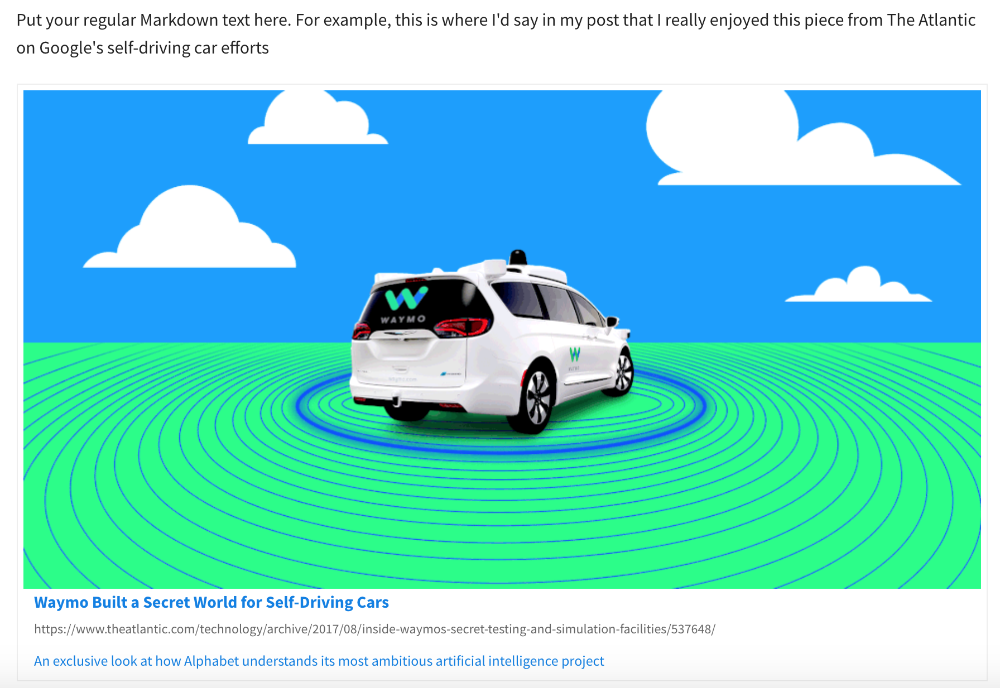

# Liquid Link Archiver and Previewer plugin

For linkblogs or posts that are about specific stories, sometimes a nice link preview is warranted. This is the same as how a Facebook post of a link includes a preview of the link included in your post.

To avoid having to refetch all of your links every time you rebuild your site, the plugin caches the information it extracts from the link in a local file and uses that cache to repopulate the template.
need the pr
create cache_file 

### Example:
```
Put your regular Markdown text here. For example, this is where I'd say in my post that I really enjoyed this piece from The Atlantic on Google's self-driving car efforts

```
and you get



You'll need to incorporate the CSS in the `archive.css` file into whatever theme you're using. 

The HTML fragment that is filled in is a Jinja2 template, so you can adjust that to match your layout tastes.

### Bugs
The Liquid Tags plugin needs a patch applied so the `PATH` config option is passed to the plugin. Hopefully [my pull request](https://github.com/getpelican/pelican-plugins/pull/945) will get merged soon, or otherwise add `PATH` to `LT_CONFIG` and `LT_HELP` in `liquid_tags/mdx_liquid_tags.py` 

You'll also need to create an `archive_cache/` directory in your pelican blog (i.e. whatever `PATH` points at), and create a `cache_file.json` with an empty dictionary (`{}`) as the sole contents. (This will be an easy fix to autocreate the directory and cache file on startup)

### Inspired by 
https://github.com/getpelican/pelican-plugins/tree/master/permalinks

https://github.com/Mononofu/link_archive (and http://www.furidamu.org/blog/2013/10/07/fighting-link-rot/ )

https://github.com/LeonardoCardoso/Link-Preview - I took the CSS and layout from Leonardo's project, which he has made available under the MIT license and is Copyright (c) 2015 Leonardo Cardoso

(a similar project: https://github.com/Ekito/bootstrap-linkpreview ) 

Slack calls it "unfurling"; https://medium.com/slack-developer-blog/everything-you-ever-wanted-to-know-about-unfurling-but-were-afraid-to-ask-or-how-to-make-your-e64b4bb9254 )

### Todo: 
 * Autocreate the cache directory and cache file on first use
 * Move the HTML fragment into pelicanconf.py or even better into a fragment.jinja2 or fragment.j2 file
 * Infer missing og headers - use title from the HTML header, take the first image found, use Twitter cards if we can't find any OpenGraph tags, etc 
 * support oembed: https://oembed.com/ (look for headers of type application/json+oembed)
 * Push link to Internet Archive and include a pointer to the archived link
 * Push link to Pinboard to get a list of tags


